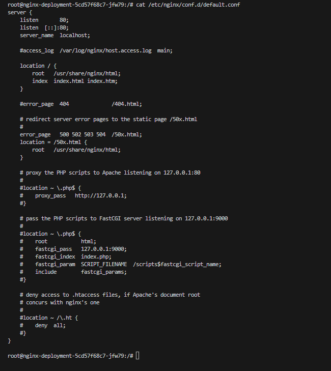
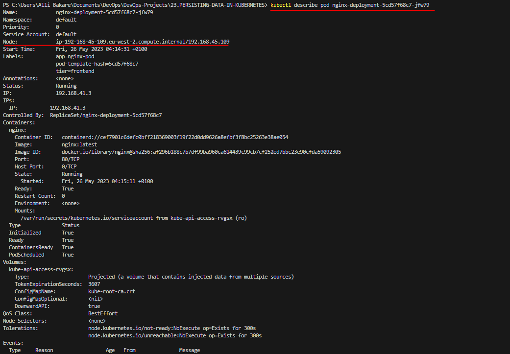
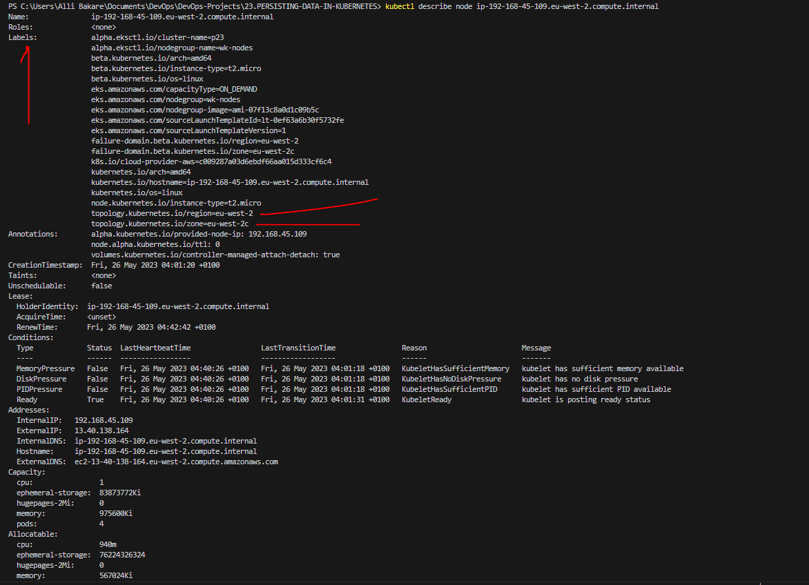
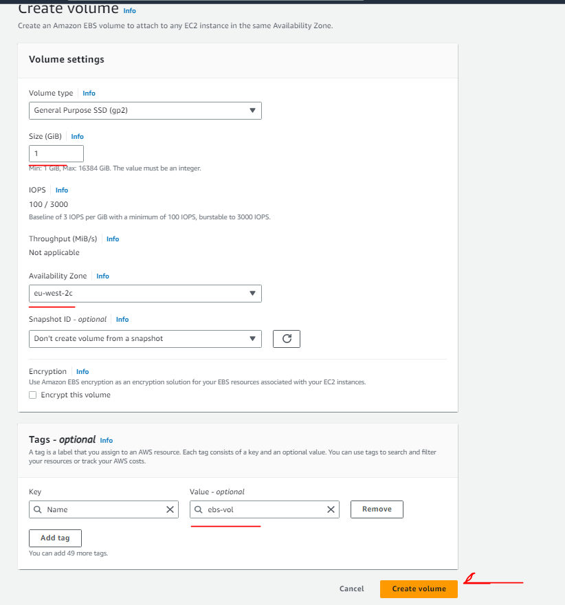
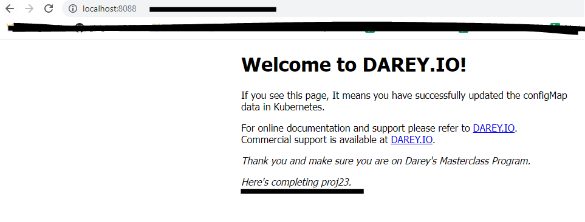

# PERSISTING DATA IN KUBERNETES

## Step 1: Set Up AWS Elastic Kubernetes Service With `EKSCTL`

* Installed [eksctl](https://github.com/weaveworks/eksctl/blob/main/README.md#for-windows-1) using chocolatey and checked version with `eksctl version`


* Ran command from terminal to set up EKS cluster:

`eksctl create cluster --name p23 --version 1.26 --region eu-west-2 --nodegroup-name wk-nodes --node-type t2.micro --nodes 2 --instance-prefix pr23`


## Step 2: Creating Persistent Volume Manually For The Nginx Application

Before creating a volume, lets run the nginx deployment into kubernetes without a volume:

`kubectl apply -f deployment.yaml`

```
apiVersion: apps/v1
kind: Deployment
metadata:
  name: nginx-deployment
  labels:
    tier: frontend
    app: nginx-pod
spec:
  replicas: 3
  selector:
    matchLabels:
      tier: frontend
      app: nginx-pod
  template:
    metadata:
      name: nginx-pod
      labels:
        tier: frontend
        app: nginx-pod
    spec:
      containers:
      - name: nginx
        image: nginx:latest
        ports:
        - containerPort: 80
```


* Verify that the pod is running and check the logs of the pod


* Exec into the pod and navigate to the nginx configuration file `/etc/nginx/conf.d`

* Open the config files to see the `default` configuration.



* ***Now that I have the pod running without a volume, I would now create a volume from the AWS console. However, I would need to know the AZ for the working node where the pod is running because it is required for the volume to be in same AZ as the working node***

Hence, find the running pod with describe command for both pod and node:

`kubectl get po nginx-deployment-5cd57f68c7-jfw79 -o wide`


`kubectl describe pod nginx-deployment-5cd57f68c7-jfw79`



`kubectl describe node ip-10-0-3-233.eu-west-2.compute.internal`

The required information is written in the `labels` section of the descibe output as seen below:



* So, in the case above, I could see the `AZ` for the node is in `eu-west-2c`, hence, the volume must be created in the same AZ. Choose the size of the required volume.




* Update and apply the `deployment` configuration with the `volume` spec:

```
apiVersion: apps/v1
kind: Deployment
metadata:
  name: nginx-deployment
  labels:
    tier: frontend
    app: nginx-pod
spec:
  replicas: 3
  selector:
    matchLabels:
      tier: frontend
      app: nginx-pod
  template:
    metadata:
      name: nginx-pod
      labels:
        tier: frontend
        app: nginx-pod
    spec:
      containers:
      - name: nginx
        image: nginx:latest
        ports:
        - containerPort: 80
      volumes:
      - name: nginx-volume
        # This AWS EBS volume must already exist.
        awsElasticBlockStore:
          volumeID: "vol-008429efedf353f30"
          fsType: ext4
```

* I did `port forward` the service and reached the app from the browser on port `8088`. 

`kubectl apply -f pf-service.yaml`

```
apiVersion: v1
kind: Service
metadata:
  name: nginx-service
spec:
  selector:
    app: nginx-pod
  ports:
    - protocol: TCP
      port: 80
      targetPort: 80
```

`kubectl  port-forward svc/nginx-service 8088:80`


* Then, update the `deployment` configuration with the `volume` spec and `volume mount`. The `volumeMounts` basically answers the question ***`Where should this Volume be mounted inside the container?`*** Mounting a volume to a directory means that all data written to the directory will be stored on that volume.

```
apiVersion: apps/v1
kind: Deployment
metadata:
  name: nginx-deployment
  labels:
    tier: frontend
    app: nginx-pod
spec:
  replicas: 1
  selector:
    matchLabels:
      tier: frontend
      app: nginx-pod
  template:
    metadata:
      name: nginx-pod
      labels:
        tier: frontend
        app: nginx-pod
    spec:
      containers:
      - name: nginx
        image: nginx:latest
        ports:
        - containerPort: 80
        volumeMounts:
        - name: nginx-volume
          mountPath: /usr/share/nginx/
      volumes:
      - name: nginx-volume
        awsElasticBlockStore:
          volumeID: "vol-008429efedf353f30"
          fsType: ext4
```

***Note***: The value provided to name in `volumeMounts` must be the same value used in the `volumes` section. It basically means mount the volume with the name provided, to the provided `mountpath`


## Step 3: Managing Volumes Dynamically With PV and PVCs

* `PV`s are resources in the cluster. `PVC`s are requests for those resources and also act as claim checks to the resource. By default in EKS, there is a default `storageClass` configured as part of EKS installation which allow us to dynamically create a PV which will create a volume that a pod will use.

* Verifying that there is a `storageClass` in the cluster: `kubectl get storageclass`

* Creating a manifest file for a `PVC`, and based on the `gp2 storageClass` a PV will be dynamically created:

```
apiVersion: v1
kind: PersistentVolumeClaim
metadata:
      name: nginx-volume-claim
spec:
      accessModes:
      - ReadWriteOnce
      resources:
        requests:
          storage: 2Gi
      storageClassName: gp2
```

* Check the setup:

`kubectl get pvc`

`kubectl describe pvc`

* Check for the volume binding section:

`kubectl describe storageclass gp2`


It will appear that the `PVC` created is in pending state because PV is not created yet. So will edit the `deployment.yaml` file to create the PV with the code below:

```
apiVersion: apps/v1
kind: Deployment
metadata:
  name: nginx-deployment
  labels:
    tier: frontend
    app: nginx-pod
spec:
  replicas: 2
  selector:
    matchLabels:
      tier: frontend
      app: nginx-pod
  template:
    metadata:
      name: nginx-pod
      labels:
        tier: frontend
        app: nginx-pod
    spec:
      containers:
      - name: nginx
        image: nginx:latest
        ports:
        - containerPort: 80  
        volumeMounts:
        - name: nginx-volume-claim
          mountPath: "/tmp/alli"
      volumes:
      - name: nginx-volume-claim
        persistentVolumeClaim:
          claimName: nginx-volume-claim
```

***Note***: The `/tmp/alli` directory will be persisted, and any data written in there will be stored permanetly on the volume, which can be used by another Pod if the current one gets replaced.


## Persisting configuration data with configMaps
According to the official documentation of [configMaps](https://kubernetes.io/docs/concepts/configuration/configmap/), A ConfigMap is an API object used to store non-confidential data in key-value pairs. Pods can consume ConfigMaps as environment variables, command-line arguments, or as configuration files in a volume.

In the use case here, I will use configMap to create a file in a volume creating and applying a manifest named `nginx-confimap.yaml` and updating it with the code below:

```
apiVersion: v1
kind: ConfigMap
metadata:
  name: website-index-file
data:
  # file to be mounted inside a volume
  index-file: |
    <!DOCTYPE html>
    <html>
    <head>
    <title>Welcome to nginx!</title>
    <style>
    html { color-scheme: light dark; }
    body { width: 35em; margin: 0 auto;
    font-family: Tahoma, Verdana, Arial, sans-serif; }
    </style>
    </head>
    <body>
    <h1>Welcome to nginx!</h1>
    <p>If you see this page, the nginx web server is successfully installed and
    working. Further configuration is required.</p>

    <p>For online documentation and support please refer to
    <a href="http://nginx.org/">nginx.org</a>.<br/>
    Commercial support is available at
    <a href="http://nginx.com/">nginx.com</a>.</p>

    <p><em>Thank you for using nginx.</em></p>
    </body>
    </html>
```

`kubectl apply -f nginx-configmap.yaml`

* Then I updated the deployment file to use the configmap in the volumeMounts section:

```
apiVersion: apps/v1
kind: Deployment
metadata:
  name: nginx-deployment
  labels:
    tier: frontend
    app: nginx-pod
spec:
  replicas: 1
  selector:
    matchLabels:
      tier: frontend
      app: nginx-pod
  template:
    metadata:
      name: nginx-pod
      labels:
        tier: frontend
        app: nginx-pod
    spec:
      containers:
      - name: nginx
        image: nginx:latest
        ports:
        - containerPort: 80  
        volumeMounts:
          - name: config
            mountPath: /usr/share/nginx/html
            readOnly: true
      volumes:
      - name: config
        configMap:
          name: website-index-file
          items:
          - key: index-file
            path: index.html
```

`kubectl apply -f deployment.yaml`

* Now the `index.html` file is no longer `ephemeral` because it is using a configMap that has been mounted onto the filesystem. This is now evident in the exec output below from the running pod while listing the `/usr/share/nginx/html` directory


It is seen that the `index.html` is now a soft link to `../data`

Though, accessing the app at this point did not change anything because the same `html` file is still in the `configmap`.

But I will go ahead to make changes to the content of the html file through the configmap, and subsequently restart the pod, changes should persist.

* List the available configmaps. You can either use `kubectl get configmap` or `kubectl get cm`

* Update the configmap, either by updating the manifest file, or the kubernetes object directly. I used the latter approach in this case.

`kubectl edit cm website-index-file`


```
apiVersion: v1
kind: ConfigMap
metadata:
  name: website-index-file
data:
  # file to be mounted inside a volume
  index-file: |
    <!DOCTYPE html>
    <html>
    <head>
    <title>Welcome to DAREY.IO!</title>
    <style>
    html { color-scheme: light dark; }
    body { width: 35em; margin: 0 auto;
    font-family: Tahoma, Verdana, Arial, sans-serif; }
    </style>
    </head>
    <body>
    <h1>Welcome to DAREY.IO!</h1>
    <p>If you see this page, It means you have successfully updated the configMap data in Kubernetes.</p>

    <p>For online documentation and support please refer to
    <a href="http://DAREY.IO/">DAREY.IO</a>.<br/>
    Commercial support is available at
    <a href="http://DAREY.IO/">DAREY.IO</a>.</p>

    <p><em>Thank you and make sure you are on Darey's Masterclass Program.</em></p>

    <p><em>Here's completing proj23.</em></p>
    </body>
    </html>
```


* Without restarting the pod, the site should be loaded automatically when the browser is refreshed as seen below:




***..........END OF PROJECT..............***


